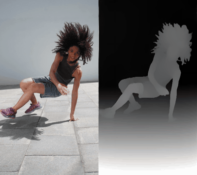
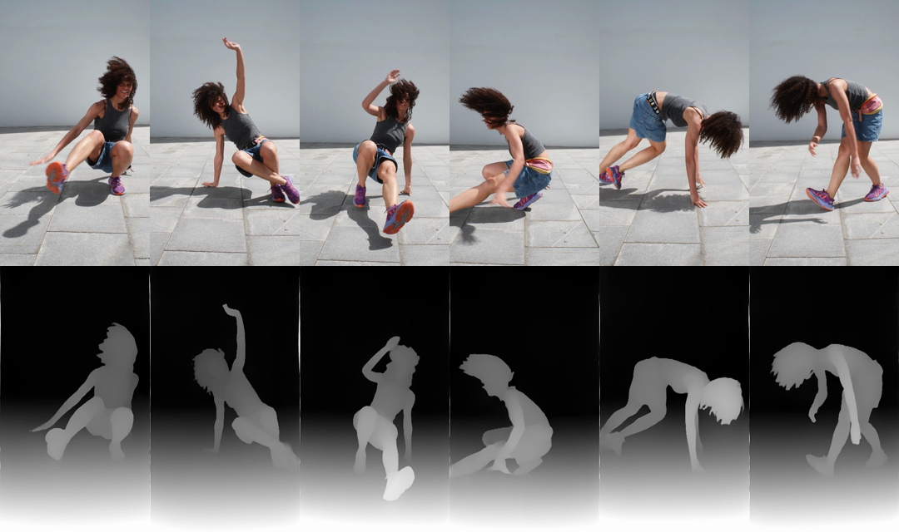

# core-ml-motion-depth-tool

영상 파일을 프레임별 depth 영상으로 변환하는 macOS CLI `video-depth`입니다. 밝을수록 카메라에 가깝습니다. 영상은 로컬에서 처리하며 첫 실행 때 모델만 내려받습니다.

## 설치

Apple Silicon Mac, Xcode Command Line Tools(`swiftc`), `ffmpeg`와 `ffprobe`, Python 3와 NumPy가 필요합니다. 예: `xcode-select --install`, `brew install ffmpeg python numpy`.

## 사용법

```sh
./video-depth input.mp4 output.mp4
```

출력은 원본의 프레임 수와 길이를 유지하는 무음 H.264 회색조 영상입니다. 모델과 컴파일 결과는 `~/Library/Caches/video-depth`에 저장합니다. 캐시 위치는 `VIDEO_DEPTH_CACHE` 환경 변수로 바꿀 수 있습니다.

## 예시

왼쪽이 원본, 오른쪽이 `video-depth` 결과입니다. 아래 움짤은 앞 8초이고, 30.8초 전체는 [dance-side-by-side.mp4](docs/demo/dance-side-by-side.mp4)에서 볼 수 있습니다.





팔다리 자세, 몸의 실루엣, 날리는 머리카락 덩어리, 바닥의 원근은 남습니다. 옷 색, 피부, 그림자, 바닥 무늬, 얼굴 생김새는 남지 않습니다. 몸 안쪽은 거의 한 가지 회색이라 팔이 몸통 앞을 지날 때 앞뒤 구분이 약하고, 얼굴 표정도 거의 남지 않습니다.

> **참조 영상은 무료 영상입니다.** [Woman Doing Breakdance](https://www.pexels.com/video/woman-doing-breakdance-8027897/) (Yaroslav Shuraev, Pexels, 2160×3840, 9:16). [Pexels 라이선스](https://www.pexels.com/license/)에 따라 무료로 쓸 수 있고 출처 표기는 선택 사항이지만, 여기서는 출처를 밝혀 둡니다. 원본을 720×1280으로 줄여 입력했고, 이 저장소에는 비교용 축소본만 넣었습니다.

### 처리 시간과 자원 사용

위 예시를 Apple M3 Pro(CPU 11코어, GPU 14코어), macOS 26.6에서 변환한 결과입니다. 모델은 이미 캐시에 있는 상태였습니다.

| 항목 | 측정값 |
| --- | --- |
| 입력 | 720×1280, 25fps, 30.8초, 770프레임 |
| 처리 시간 | 26.8–28.7초 (2회), 프레임당 약 0.035초. 원본 길이보다 빠름 |
| 총 CPU 시간 | 44.5초 (user 39.8초 + sys 4.7초). 처리 중 평균 약 1.6코어 사용 |
| CPU 사용률 (0.5초 간격) | 평균 137%, 상위 5% 구간 825% (100% = 코어 1개) |
| 프로세스별 평균 CPU | ffmpeg(디코딩·인코딩) 120%, Python 9%, Core ML 추론 8% |
| GPU 사용률 | 평균 6.8%, 상위 5% 구간 28% (대기 상태: 평균 2.5%, 최대 13%) |
| Neural Engine | 직접 측정하지 못함 (`powermetrics`에 관리자 권한 필요) |
| 메모리 | 관련 프로세스 합계 최대 약 1.8GB |

추론은 Core ML에 `computeUnits = .all`로 맡깁니다. 추론 프로세스의 CPU 사용이 8%에 그치고 GPU 사용률도 대기 때보다 약 4%p만 올랐으므로, 추론은 대부분 Neural Engine에서 돈 것으로 봅니다. CPU는 주로 ffmpeg가 영상을 읽고 쓰는 데 씁니다. GPU 사용률은 화면 표시 등 다른 앱 사용분이 섞인 시스템 전체 값입니다. 첫 실행 때는 모델 다운로드와 컴파일 시간이 더해집니다.

모델: [Apple Core ML Depth Anything V2 Small](https://huggingface.co/apple/coreml-depth-anything-v2-small), 리비전 `cfef6f6f2a70783dedc0bfae40cecbc2052285d3`, 라이선스 **Apache-2.0**. 다운로드 파일의 SHA-256을 확인합니다.

## 알려진 한계

- macOS/Apple Silicon 전용입니다. 깊이는 상대적인 밝기이며 실제 거리 단위가 아닙니다.
- 작은 물건과 미세한 얼굴 표정은 약하게 표현될 수 있습니다. 화면에 합성된 글자나 도형은 평평한 형태로 남을 수 있습니다.
- 장면 전환을 따로 처리하지 않습니다. 밝기 범위가 약 1초에 걸쳐 서서히 따라가므로, 전환 직후 몇 프레임은 일부가 너무 밝거나 어둡게 잘리고 1초 안팎의 짧은 장면은 대비가 낮게 보일 수 있습니다. 내용이 없는 단색 화면에서는 의미 없는 그라데이션이 나옵니다.
- 가변 프레임레이트 영상은 프레임 수와 전체 길이를 맞추지만 개별 프레임의 시간 간격은 보존하지 않습니다.
- H.264 `yuv420p`는 짝수 크기가 필요하므로 홀수 가로·세로 크기는 각 축을 최대 1픽셀 늘립니다.
